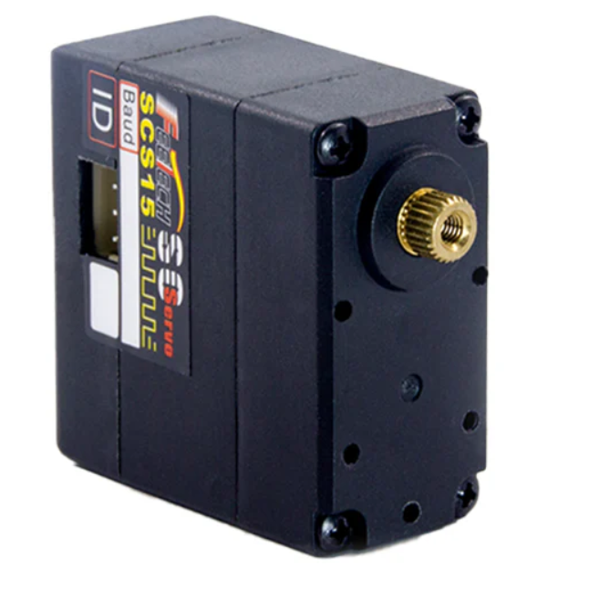
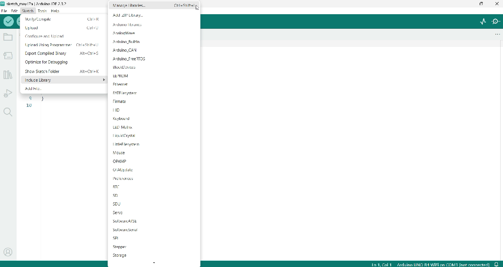

# Stegosaurus Project
The goal of this project is to create a moving robot by controlling it with a Central Pattern Generator (CPG) and virtual hormones, which simulate how the nervous system works in living things. To guarantee the robot operates realistically, the project also entails building physical models in SolidWorks and constructing electrical circuits.

## Installation 
In order to ensure a smooth start, this section includes a list of prerequisites and instructions for installing the required hardware and software for the robot project.

### **Prerequisites**

1. Operating System 
   - Windows

      
      

2. Software 
- Arduino IDE (for programming Arduino)

   
   
   

- SolidWorks (for robot design)

    
   
   

 3. Hardware

      <table style="width:100%; border-collapse: collapse;">
      <thead>
         <tr>
            <th style= "text-align:center;">No.</th>
            <th style= "text-align:center;">List</th>
            <th style= "text-align:center;">Image</th>
            <th style= "text-align:center;">Amount (Pcs)</th>
         </tr>
      </thead>
      <tbody>
         <tr>
            <td style= "text-align:center;">1.</td>
            <td style= "text-align:center;">Arduino UNO R4 WIFI</td>
            <td style= "text-align:center;"></td>
            <td style= "text-align:center;">1</td>
         </tr>
         <tr>
            <td style= "text-align:center;">2.</td>
            <td style= "text-align:center;">FE-URT-1</td>
            <td style= "text-align:center;"></td>
            <td style= "text-align:center;">1</td>
         </tr>
         <tr>
            <td style= "text-align:center;">3.</td>
            <td style= "text-align:center;">SCS15</td>
             <td style= "text-align:center;"></td>
            <td style= "text-align:center;">8</td>
         </tr>
         </tr>
            <td style= "text-align:center;">4.</td>
            <td style= "text-align:center;">Helicox 3000mA</td>
             <td style= "text-align:center;"></td>
            <td style= "text-align:center;"> 1 </td>
         </tr>
         </tr>
            <td style= "text-align:center;">5.</td>
            <td style= "text-align:center;">US-015 Ultrasonic Sensor Module</td>
             <td style= "text-align:center;"></td>
            <td style= "text-align:center;"> 2 </td>
         </tr>
          </tr>
            <td style= "text-align:center;">6.</td>
            <td style= "text-align:center;">Vehicle tires</td>
             <td style= "text-align:center;"></td>
            <td style= "text-align:center;"> 1 </td>
         </tr>
      </tbody>
      </table>

### **Software Installation Steps**
1. Install Arduino IDE
- The Arduino IDE can be downloaded and installed from the [Arduino website](https://www.arduino.cc/en/software/).
- Launch the Arduino IDE and add the required libraries, like Math and [SCServo](https://github.com/IS2511/SCServo/blob/master/SCSCL.cpp). 
   
   **Zip file installation for the library**
   - Get the Library from here in a zip file. 

      

   - Open the Arduino IDE program, go to Sketch > Include Library > Add .ZIP Library, then pick the file that you downloaded.

      

    **Installing more Arduino libraries**

     - Open the Arduino IDE program, go to Sketch > Include Library > Manage Libraries.
     
        

    - In the search box, type the name of the desired library. Click More info to see how to utilize it. Click the Install button in order to install.
      
      

2. Install SolidWorks
- SolidWorks can be downloaded and installed from the [SolidWorks official website](https://www.solidworks.com/sw/support/downloads.htm).
- Launch SolidWorks and confirm that all required modules, including Part, Simulation and Electrical, are installed.

### **Hardware Installation Steps**
1. Assemble the Robot Structure
- The robot's primary structure can be constructed using the assembly guide found in the SolidWorks files.
- Place electrical in the designated locations.   

2. Connect the Electrical Circuit

- Wires between the microcontroller(Arduino uno r4), servo, sensors, and batteries should be installed and connected using the electrical circuit schematic.
- Make sure every connection is safe and secure.

   

3. Energy consumption
   - The battery used is a Helicox 3000mA. A single battery can last approximately 1-2 hours,    as can be seen from the following calculations
     
     
## Robot Design
### **Main Structure**
1. This robot is designed to walk on four legs, with the main materials used being: 

   - PLA+ Filament 

   - Acrylic 2 mm thick 

   - Wooden boards 2.5 mm and 4 mm
     
   ** Replacing the leg material from wood to acrylic might yield better results, but be cautious of material breakage.

   
   assemble whit out skin
   
   Assemble full skin 
   
 2. The skeleton of the Stegosaurus has front and hind legs of different sizes. Therefore, the designer made the front and hind legs of different sizes, with a ratio of 1:1.51, but the size difference does not exceed 2 times.
   
   
 3.Based on calculations, this robot can support a weight of approximately 1500 grams, with a tolerance of ±250 grams

   
   
 4. The designer tested and found that the hind legs can support a weight of 750 grams. When the robot starts walking, there are always two legs on the ground. Therefore, the robot can support a weight of approximately 1500 grams, with a tolerance of no more than ±250 grams.
   
 5. You can view the CAD model in the STEP file named as shown in the image.
    

### **Joints and Actuators**

- The robot has wood for its joints and legs. To further aid secure the armor to the ground, rubber was also used to protect the feet.

   [Watch the video on YouTube](https://youtu.be/n-jgDqc_dPE)

## Configuration and Customization
1. CPG 

   Utilize the values for O1 and O2 to run the motor. To move the legs up and down, use O2, and to go forward and backward, use O1.

    
   
      Values for O1 and O2, derived from graphing in [excel](https://pim365-my.sharepoint.com/:x:/r/personal/6452500121_stu_pim_ac_th/_layouts/15/Doc.aspx?sourcedoc=%7B3D47D774-FDE3-4311-9CD7-444A83FABF04%7D&file=project%20.xlsx&action=default&mobileredirect=true&DefaultItemOpen=1&login_hint=6452500121%40stu.pim.ac.th&ct=1716663021386&wdOrigin=OFFICECOM-WEB.MAIN.REC&cid=67ed9d8f-d7ad-4c99-95e9-1ad7726ff029&wdPreviousSessionSrc=HarmonyWeb&wdPreviousSession=2518b866-0c7a-4d60-9b7b-da8b720042b8)

2. Hormones Concentration

   Calculation : Takes the value of the sensor as input. Then take the standard deviation to represent the hormonal changes in each period. Then bring it into the hormone equation to get the amount of hormones secreted, which is the HC (Hormones Concentration) value.
   
   (Hormone calculation)

   https://docs.google.com/spreadsheets/d/1ysU-uzWMpW0UrVVLxHHKWWODgd5BCDr7dVBZ5aWzhAU/edit?usp=sharing
   
   (ภาพที่ 1 ตาราง+สมการ)

   In addition, the HC value must be calculated with the Hormones Receoter to get the value that affects mood.

   (ภาพที่ 2 การจับฮอร์โมน ตัวจับ)
   
   Results and graphs : The difference between having and not having hormones will result in a change in the behavior of the robot. This is because the changing hormonal values ​​affect the conditions in which the robot responds.

   (ภาพที่ 3 ตารางความแตกต่างระหว่างมีไม่มี + เขียนใต้ภาพว่าเปรียบเทียบในกรณีไหน กราฟเส้นเดี่ยว)

   (ภาพที่ 4 ตารางความแตกต่างระหว่างมีไม่มี + เขียนใต้ภาพว่าเปรียบเทียบในกรณีไหน กราฟเส้นเดี่ยว *2)

3. Walking Test Steps
   - Experiment 1:  
         - In this experiment, we will conduct walking tests on two types of terrain: flat             terrain without obstacles and flat terrain with obstacles. 
         - Additionally, we will compare the effectiveness of walking with and without                 springs. Which method is more effective?
         - by having the robot walk a distance of 50 centimeters within 15 minutes.
     
     

   - You can watch a video clip for the experiment at this link, which is a compilation of 1 video from the 4 experiments.
     [Watch the video on YouTube](https://youtu.be/K6Rzk2AfT0k)

   - From the experiment results, we summarized the findings in a graph. It was found that    walking with springs improved performance compared to walking without springs, on both obstacle-free and obstacle-laden terrain. However, for the walking test on obstacle-laden terrain without springs, we could not conclude the results in the last three trials because the robot front legs broke.
     
     
     
     

   

## Authors and Contributors
- Miss Supannee   Saengwonrarach    6452500121
- Miss Phansa     Romruen           6452500155
- Miss Awanta     Arwon             6452500236
- Miss Thanita    Kaeoking          6452500244
- Miss Napasawan  Sittikham         6452500295
- Miss Sudaporn   Saenyakiattikhun  6452500376
